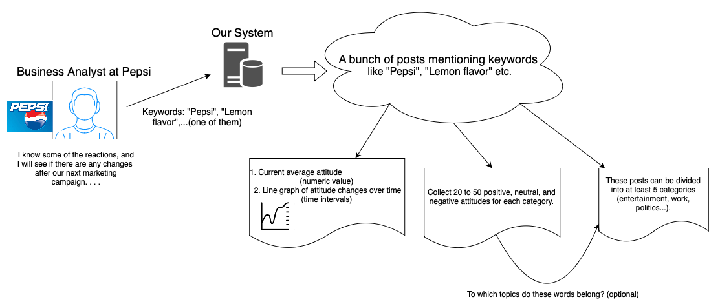
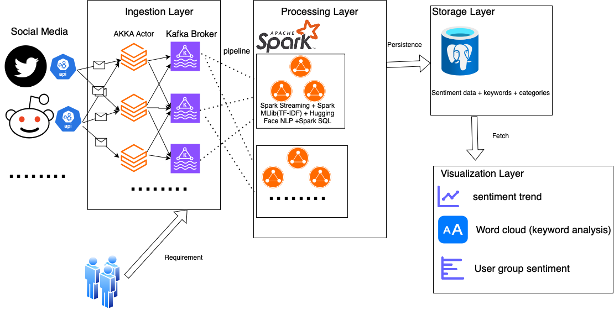

# social-media-keywords-sentiment-analysis-system

Real-Time Social Media Keywords Sentiment Analysis System Based on Scala and Spark
This project aims to build a real-time social media sentiment analysis system leveraging big data processing and natural language processing (NLP). It analyzes textual sentiment from platforms like Twitter and Reddit, providing instant insights into trending events, brand perception, and public opinion. *Handle sentiment analysis requests in parallel using Akka Actors. *Stream real-time data using Kafka. *Store sentiment analysis results in PostgreSQL. ===Enterprise Brand Monitoring – Track customer sentiment and brand reputation in real-time.

## User Story

## System Architecture

